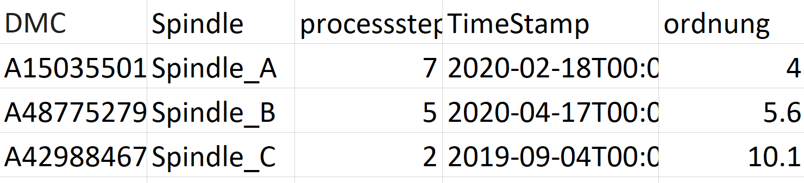

# PySpark_interpolation

## Resampling the Order of the Fourier Transform data

The dataset is as shown below, with columns namely DMC (part denotion), Spindle, processstep, TimeStamp and Ordnung (Orders of the Fourier Transform)

In the above image the Ordnung data must first be resampled. This would be simple to do if we were using Pandas; all we would need to do is call the resample() function. However, Spark does not offer a comparable solution since it uses distributed datasets. In PySpark, the same capability may be attained by a three-step procedure. In the first step, we group the data by 'DMC', 'spindle', 'processstep', 'TimeStamp' and generate an array containing an equally spaced order range for each of the 'DMC', 'spindle', 'processstep', 'TimeStamp'. We can create one row for each element of the arrays by using the spark SQL function explode(), but this is very expensive in terms of memory and performance. In the third step, the resulting structure is used as a basis to which the existing information is joined using an outer join.

## Forward-filling and Backward-filling Using Window Functions
